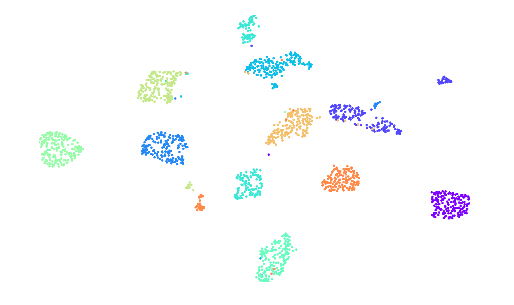
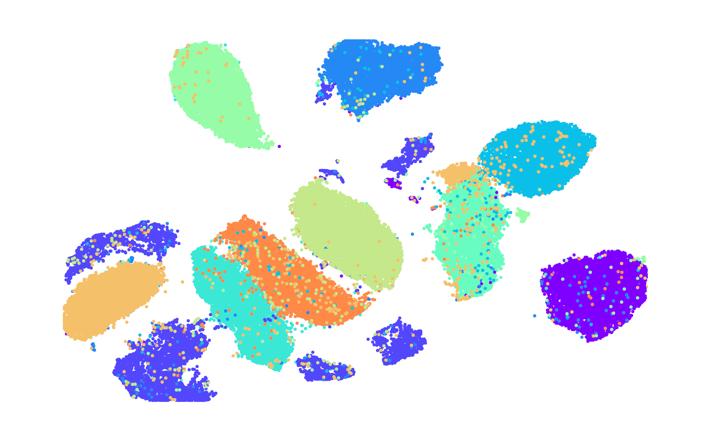

# DistViz

This framework includes the implementation of the following algorithms.
  - [Distributed Random Projection Trees (DRPT)](https://github.com/HipGraph/DRPT) algorithm constructs a K-Nearest Neighbor Graph (KNNG) for Approximate Nearest Neighbor Search (ANNS) from a given dataset.
  - [Force2Vec](https://github.com/HipGraph/Force2Vec) graph emdbedding algorithm which can be used to visualize the resulting K-Nearest Neighbor Graph (KNNG) produced by DRPT.

Theese algorithms are implemented in C++ and leverages MPI for distributed processing, making it suitable for large-scale datasets across multiple nodes in HPC environments.


## System Requirments
Ensure the following tools and libraries are installed before building the project. The source code was compiled and run successfully in NERSC Perlmutter.
```
GCC version >= 13.2
OpenMP version >= 4.5
CMake version >= 3.30.2
intel version >= 2024.1.0
cray-mpich version >= 8.1.30
CombBLAS
Eigen version >= 3.3.9
PCG version >= 0.98
```

Some helpful links for installation can be found at [GCC](https://gcc.gnu.org/install/), [OpenMP](https://clang-omp.github.io) and [Environment Setup](http://heather.cs.ucdavis.edu/~matloff/158/ToolsInstructions.html#compile_openmp).

Please refer to the following guides to install CombBLAS, Eigen, and PCG respectively:
  1. CombBLAS - [Installation Guide](https://github.com/PASSIONLab/CombBLAS/blob/master/README.md)
  2. Eigen - [Installation Guide](https://libeigen.gitlab.io/docs/GettingStarted.html)
  3. PCG - [Download & Setup](https://www.pcg-random.org/download.html)

## Installation
1. Load/ install the modules mentioned in System Requirments. 
2. Clone the repository using the following command.
```bash
git clone https://github.com/HipGraph/DistViz.git
```
3.  Set the following environment variables
```bash
export COMBLAS_ROOT=<path/to/CombBLAS/root>
export EIGEN_ROOT=<path/to/Eigen/root>
export PCG_ROOT=<path/to/PCG/root>
```
4. Run the following commands in order to compile and build the framework using CMake.
```bash
cd DistViz
mkdir build
cd build
cmake -DCMAKE_CXX_FLAGS="-fopenmp"  ..
make all
```

## Run
Let’s run a couple of examples to demonstrate how to execute the DRPT algorithm on a dataset and visualize the resulting K-Nearest Neighbor Graph (KNNG) using the Force2Vec embedding algorithm using this framework.

This test run is designed for High-Performance Computing (HPC) environments with [Slurm](https://slurm.schedmd.com/documentation.html) as the workload manager. Ensure you have access to an HPC cluster running Slurm before proceeding.

The following two datasets are used to demonstrate the example execution.
  1. PenDigits dataset
  2. [MNIST dataset](https://www.kaggle.com/datasets/hojjatk/mnist-dataset)

### 1. PenDigits Dataset

PenDigits is a smaller (compared to MNIST) dataset consisting of handwritten digits.
  - Dataset size - 1797
  - Dimension - 65
  - Number of classes - 10

> Note: Since the PenDigits dataset  is relatively small in size, it is already included in [test/data](./test/data/) folder.

#### 1.1 Build the KNNG and Generate Embeddings
1. Navigate into the [test](./test) folder.
```bash
cd test
```
2. Before running the framework, create a directory to store the outputs. For example:
```bash
mkdir output
```
3. Run the framework by submitting the Slurm script [run_distviz_on_pendigits.sh](./test/run_distviz_on_pendigits.sh), as a batch job.
```bash
sbatch run_distviz_on_pendigits.sh
```
  - This script will run the DRPT algorithm on the PenDigits dataset located in [test/data/pen_digits](./test/data/pen_digits) and generates the KNNG and its embeddings.
  - Here, the K value is set to 10, and the workload is distributed among 2 nodes.
4. Once the job completes:
    - Check the output log file (`%j.log`) for progress and any errors.
    - Verify that the KNNG output file (`knng.txt`) appears in your specified output directory.
    - The `knng.txt` file should contain an edge list representing the KNNG graph.
    - Additionally, confirm that an `embedding.txt` file is generated in the output directory. This file contains the generated embeddings corresponding to the nodes in the KNNG, which can be used for visualization and analysis.
5. In order to generate the embeddings, convert the `knng.txt` file into Matrix Market (`.mtx`) format by adding the following two lines to the top of the file and renaming the extension to `mtx` instead of `txt`.
```
%%MatrixMarket matrix coordinate pattern general
1797 1797 16173
```
  - First two 1797s represent the number of nodes (rows and columns of the adjacency matrix).
  - The last 16173 is the number of edges (non-zero entries).

#### 1.2 Visualize the KNNG using the Embeddings
1. Make sure you have python (version >= 3.6) is installed. You can check your version with:
```bash
python3 --version
```
2. Next create and activate a python virtual environment to keep dependencies organized:
```bash
pip install venv
python3 -m venv venv
source venv/bin/activate
```
3. Install the following python dependnies using `pip install`.
```
scikit-learn version >= 0.24.2
matplotlib version >= 3.3.4
networkx version >= 2.5.1
community version >= 1.0.0
```
4. Run the python script [run_visualization.py](./test/visualization/run_visualization.py) (in the visualization directory) to generate the visualization of the KNNG:
```bash
cd visualization
python3 -u ./run_visualization.py ../output/knng.mtx 1 ../output/embedding.txt 2 ../data/pen_digits/digit_labels.txt pen_digits_knng_embedding
```
> Note: [digit_labels.txt](./test/data/pen_digits/digit_labels.txt) represents the actual node lables of the dataset.
6. After running the script, check if a PDF file with the visualization has been generated.
    - Open the PDF to ensure the embeddings are properly visualized as follows. You should see a clear structure where similar data points (data points belonging to the same label) cluster together, reflecting the generated KNNG.

    

### 2. MNIST Dataset

MNIST is a widely used dataset which consists of a set of handwritten digits. 
  - Dataset size - 60000
  - Dimension - 784
  - Number of classes - 10

> Note: Since the MNIST dataset is relatively large in size, it is not included in the repository.

#### 2.0 Download the Dataset
1. Navigate into the [test](./test) folder.
```bash
cd test
```
2. Download and extract the MNIST dataset (`train-images.idx3-ubyte` dataset) into the [test/data/MNIST](./test/data/MNIST/) folder by using the following url.
    - https://www.kaggle.com/datasets/hojjatk/mnist-dataset?select=train-images.idx3-ubyte

#### 2.1 Build the KNNG and Generate Embeddings

1. Before running the framework, make sure that you have a directory to store the outputs. If not, create a folder as follows.
```bash
mkdir output
```
2. Run the framework by submitting the Slurm script [run_distviz_on_mnist.sh](./test/run_distviz_on_mnist.sh), as a batch job.
```bash
sbatch run_distviz_on_mnist.sh
```
  - This script will run the DRPT algorithm on the MNIST dataset located in [test/data/MNIST](./test/data/MNIST) and generates the KNNG and its embeddings.
  - Here, the K value is set to 10, and the workload is distributed among 4 nodes.
3. Once the job completes check whether following output files have been generated as before.
    - Output log file (`%j.log`)
    - KNNG output file (`knng.txt`)
    - Embeddings output file (`embedding.txt`)
4. In order to generate the embeddings, convert the `knng.txt` file into Matrix Market (`.mtx`) format by adding the following two lines to the top of the file and renaming the extension to `mtx` instead of `txt`.
```
%%MatrixMarket matrix coordinate pattern general
60000 60000 540000
```

#### 2.2 Visualize the KNNG using the Embeddings
1. Make sure you have completed the prerequisites mentioned in the PenDigits example. If the Python virtual environment is not already activated, please activate it using the folling command.
```bash
source venv/bin/activate
```
2. Run the python script [run_visualization.py](./test/visualization/run_visualization.py) (in the visualization directory) to generate the visualization of the KNNG:
```bash
cd visualization
python3 -u ./run_visualization.py ../output/knng.mtx 1 ../output/embedding.txt 2 ../data/MNIST/mnist.labels.txt mnist_knng_embedding
```
> Note: [mnist.labels.txt](./test/data/MNIST/mnist.labels.txt) represents the actual node lables of the dataset.
3. After running the script, check if a PDF file with the visualization has been generated.
    - Open the PDF to ensure the embeddings are properly visualized as follows. You should see a clear structure where similar data points (data points belonging to the same label) cluster together, reflecting the generated KNNG.

    
